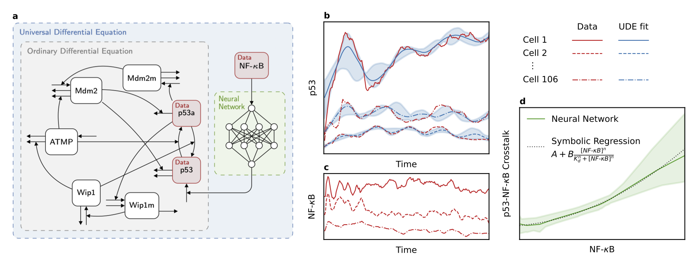

# UDE-crosstalk-discovery

Source code for the paper:

> **Universal differential equations for quantifying NF-κB – p53 signaling crosstalk**
> Umur Can Kaya, Xhemal Kodragjini, Samuel Zambrano, Katharina Baum
> *Submitted to ECCB 2026*

The framework uses universal differential equations (UDEs), mechanistic p53 ODE models augmented with a neural network component, to quantify NF-κB–p53 signaling crosstalk from 106 simultaneously measured single-cell time series. Symbolic regression then distills the learned crosstalk function into a compact closed-form expression.



## Prerequisites

- Python 3.10
- [uv](https://docs.astral.sh/uv/getting-started/installation/) — package manager

## Setup

1. Clone the repository and navigate to the `code` folder:
   ```bash
   cd code
   ```
2. Install dependencies:
   ```bash
   uv sync
   ```
3. Activate the virtual environment:
   ```bash
   # Mac/Linux
   . ./.venv/bin/activate

   # Windows
   . ./.venv/Scripts/activate
   ```

## Workflow Overview

The pipeline consists of three main stages:

1. **Data generation** (synthetic experiments) — generate synthetic NF-κB and p53 time series with a known ground-truth crosstalk function
2. **UDE training** — train a UDE on synthetic or real data to learn the hidden crosstalk function
3. **Post-processing** — apply symbolic regression and Hill-type regression to the learned neural network output for interpretability

## Running the Full Synthetic Pipeline

The easiest way to run a complete synthetic experiment (NF-κB generation → p53 simulation → UDE training) is via the master pipeline script:

```bash
python run_full_synthetic_pipeline.py config/synthetic_pipeline_master_konrath.json
# or
python run_full_synthetic_pipeline.py config/synthetic_pipeline_master_hunziker.json
```

This orchestrates NF-κB signal generation, p53 data simulation with a known crosstalk function, and UDE training in a single run, storing all outputs in a unified experiment directory.

## Running the Multivariate Study

To reproduce the systematic synthetic experiments from the paper (sweeping over models, crosstalk function types, noise levels, and sample sizes):

```bash
python run_multivariate_study.py
```

Study parameters (models, crosstalk functions, noise levels `η`, sample sizes `M`) are configured at the top of the script. Results are aggregated into a summary CSV and stored under `experiments/`.

## Step-by-Step: Synthetic Data Experiments

### 1. Generate NF-κB signals

```bash
python generate_nfkb_signals.py config/nfkb_signal_generation_zambrano.json
```

Config parameters:

- `n_signals` — number of signals to generate
- `change_scale` — parameter variation scale relative to nominal values
- `sample_initial_conditions` — `"Yes"` or `"No"`

### 2. Generate p53 dynamics without crosstalk

```bash
python generate_p53_without_nfkb.py config/synthetic_data_p53_no_nfkb_konrath.json
```

### 3. Generate p53 dynamics with crosstalk

```bash
python generate_p53_with_nfkb.py config/synthetic_data_p53_nfkb_func_konrath.json
```

Set `crosstalk_function_type` in the config to one of:

- `"monoton_increasing_weak_hill"` — weak activating Hill function
- `"monoton_increasing_strong_hill"` — strong activating Hill function
- `"monoton_decreasing_weak_hill"` — weak inhibitory Hill function
- `"monoton_decreasing_strong_hill"` — strong inhibitory Hill function

### 4. Train the UDE (synthetic)

```bash
python train_ude_synthetic_data.py config/ude_p53_konrath_init_resample.json
```

Set `crosstalk_function_type` to match the function used in step 3.

## Step-by-Step: Real Data Experiments

The experimental single-cell p53 and NF-κB time series (106 cells, 200 time points) must be placed in the `real_data/` folder. The data was generated in [Colombo et al. 2026] and is available from that publication.

### 5-Fold Cross-Validation

To evaluate generalisation with k-fold cross-validation, use the dedicated supervisor script. It automatically spawns one worker process per fold × seed combination:

```bash
python train_ude_real_data_kfold.py config/ude_p53_konrath_kfold_verify.json
```

The config must include two additional keys on top of the standard real-data keys:

| Key | Description |
|-----|-------------|
| `n_folds` | Number of folds (e.g. `5` for 5-fold CV) |
| `cv_seed` | Random seed used to generate the fold splits |

Results for all folds and seeds are written to a single batch directory under `experiments/`. Symbolic regression and Hill regression are **not** run automatically in this mode.

### Train the baseline ODE (no crosstalk)

```bash
python train_ode_real_data.py config/ude_p53_konrath_real_data_init_resample.json
```

### Train the UDE (with crosstalk)

```bash
python train_ude_real_data.py config/ude_p53_konrath_real_data_init_resample.json
```

For ensemble runs used in the paper:

```bash
python train_ude_real_data.py config/ude_p53_konrath_real_data_multi_run.json
```

Hunziker-based equivalents follow the same pattern using `ude_p53_hunziker_real_data_*.json`.

## Reusing Trained Models

### Load the neural network

```python
import jax
from utils.neural_networks import SynthNN
import equinox as eqx

key = jax.random.PRNGKey(0)
neural_net = SynthNN(key)
neural_net_single = eqx.tree_deserialise_leaves("path/to/neural_network.eqx", neural_net)
neural_net = jax.vmap(lambda x: neural_net_single(x))
predictions = neural_net(nfkb_values.reshape(-1, 1))
```

### Load the symbolic regression result

```python
from load_symbolic_model_externally import load_symbolic_model_externally

symbolic_model = load_symbolic_model_externally("path/to/experiment/folder")
symbolic_values = symbolic_model(nfkb_values)
```

### Load a full trained UDE and solve it

```bash
python load_ude_model_externally.py /path/to/your/experiment/folder
```

## Repository Structure

```
code/
├── config/                        # Config files for all experiments
├── experiments/                   # Output directories (created at runtime)
├── plots/                         # Figures for the paper
├── real_data/                     # Single-cell p53 and NF-κB time series
├── utils/                         # Model definitions, ODE/UDE solvers, plotting
│   ├── models.py                  # UDE and ODE model implementations
│   ├── neural_networks.py         # MLP architecture for crosstalk function
│   ├── differential_equations_functions.py
│   ├── symbolic_new_regression_multi.py  # Symbolic regression (ensemble)
│   ├── hill_regression_multi.py   # Hill-type regression on learned crosstalk
│   ├── plot_functions.py
│   └── ...
├── generate_nfkb_signals.py       # Generate synthetic NF-κB time series
├── generate_p53_without_nfkb.py   # Generate p53 without crosstalk
├── generate_p53_with_nfkb.py      # Generate p53 with known crosstalk function
├── train_ude_synthetic_data.py    # Train UDE on synthetic data
├── train_ude_real_data.py         # Train UDE on experimental data
├── train_ude_real_data_kfold.py   # K-fold cross-validation for real-data UDE experiments
├── train_ode_real_data.py         # Train baseline ODE (no crosstalk) on real data
├── run_full_synthetic_pipeline.py # End-to-end synthetic pipeline runner
├── run_multivariate_study.py      # Sweep over models / noise / sample sizes
├── load_symbolic_model_externally.py
└── load_ude_model_externally.py
```

## References

[1] F. Konrath, A. Mittermeier, E. Cristiano, J. Wolf, and A. Loewer, "A systematic approach to decipher crosstalk in the p53 signaling pathway using single cell dynamics," *PLOS Computational Biology*, vol. 16, no. 6, p. e1007901, 2020.

[2] A. Hunziker, M. H. Jensen, and S. Krishna, "Stress-specific response of the p53-Mdm2 feedback loop," *BMC Systems Biology*, vol. 4, no. 1, p. 94, 2010.

[3] E. Colombo et al., "NF-κB transcriptionally contributes to the up-regulation of p53 through increased *TP53* expression," 2026.
